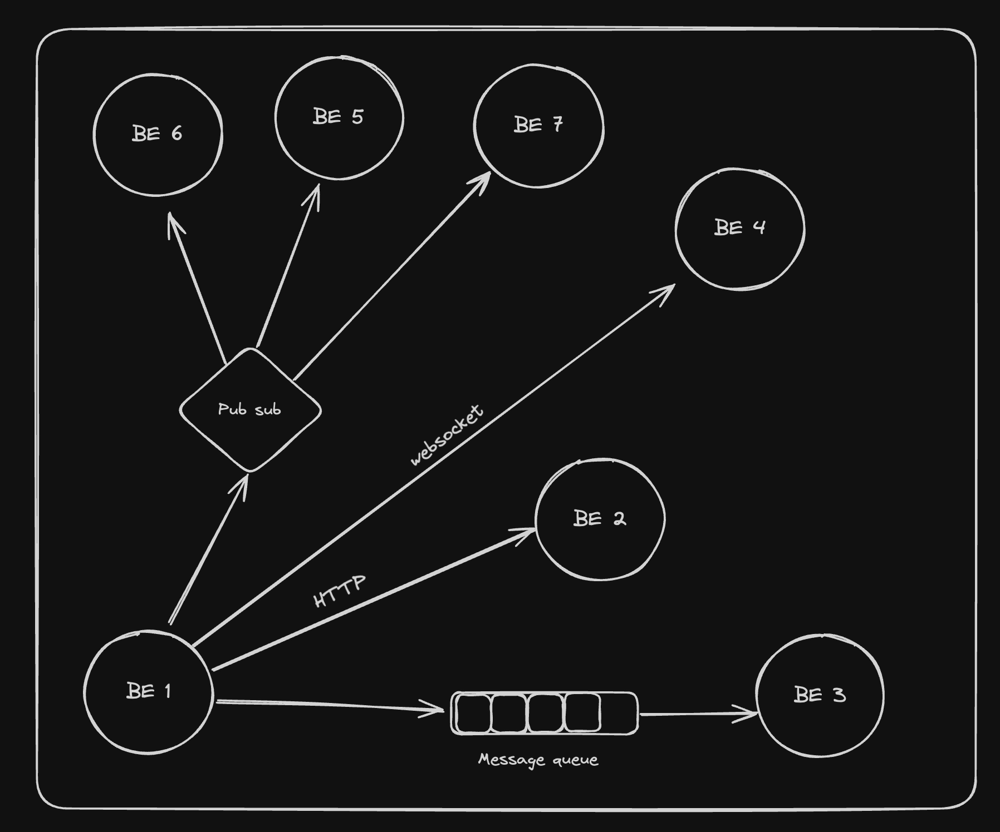

## What is backend communication?
When two backend services talk to each other for differnt methods.


### Types of communication
#### Synchronous (Strong coupling)
- HTTP (REST/GraphQL)
- Websocket (debatable if sync or async)
 
#### Asynchronous (Weak coupling)
- Messaging queues
- Pub subs
- Server-Sent Events 
- Websocket (debatable if sync or async)

### Redis
Redis is an open-source, in-memory data structure store, used as a database, cache, and message broker. One of the key features of Redis is its ability to keep all data in memory, which allows for high performance and low latency access to data.

```bash
docker run --name my-redis -d -p 6379:6379 redis
```
#### Redis as a DB
##### SET/GET/DEL
```bash
SET mykey "Hello" 
GET mykey
DEL mykey
# pushing to a queue
LPUSH problems 1
LPUSH problems 2
# Poping from queue
RPOP problems
RPOP problems
# Bloked pop
BRPOP problems 0
BRPOP problems 30 
```
